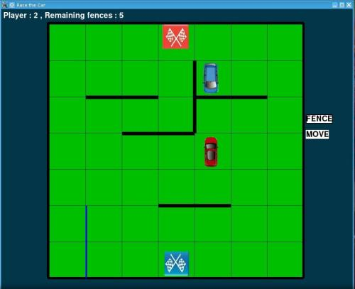
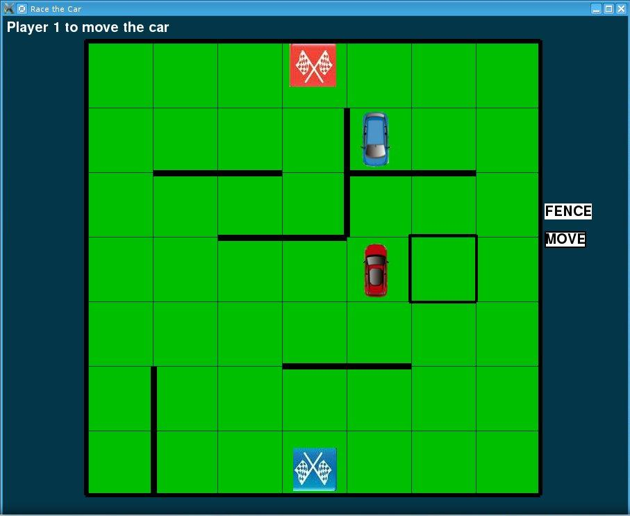
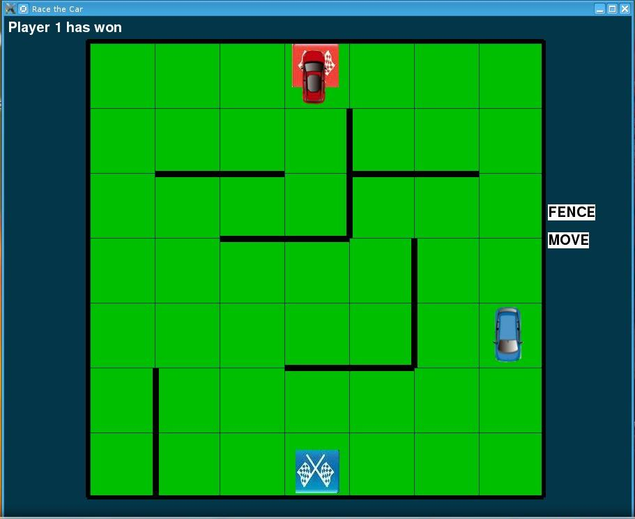

# Race-the-car
An exciting strategy board game created on python,as a part of learning project.  
More like a shorter version of chess, where one needs to stay focussed ,anticipate the other player moves and cover all the tracks.

## Installation guide
#### Option 1: By creating a Executable file
* Clone the repo
```sh
$ git clone https://github.com/NJACKWinterOfCode/Race-the-car.git
$ cd Race-the-car
```
* If you don't have cx_Freeze installed, get it by typing the following in command promt(for Windows)
```sh
$ pip install cx_Freeze
```
* If you don't have cx_Freeze installed, get it by typing the following in terminal(for Linux)
```sh
$ sudo apt install cx-freeze
```
* After installing cx_Freeze type the following in command pront/terminal
```sh
$ python setup.py build
```
* A folder named build will be created in the same directory which will be containing the executable file of the game.Run the excutable and enjoy Race-the-car.

#### Option 2: Build from source
* Clone the repo
```sh
$ git clone https://github.com/NJACKWinterOfCode/Race-the-car.git
$ cd Race-the-car
```
* Install all dependencies using requirements.txt by executing the follwing command in command promt/terminal
```sh
$ pip install -r requirements.txt
```
* Now run the game source through command promt/terminal
```sh
$ python Race_the_car.py
```

## Objective
In this game two players need to reach the desired destination(the finish flag of respective colors), the one reaching first will win the game.

## Twist
To make game interesting each player is provided with 8 fences to make opponent's path difficult.

## Rules
* When its your turn, you can move your car forward, backward, left or right; only one square at a time or can either put up a fence.  
* Fence can block only two squares completely,are limited in number i.e each of them can use a maximum of 8 fences & the opponent should not be blocked completely.  
* One route must be available to the opponent,if failing to do so the player who blocked the car will lose the game.  
* If there is a fence any player cannot move the car over it.A fence can not be overlapped and it cannot pass from the middle of the another fence.  
* When two cars come face to face, one car can jump over the other in its turn ,also the car can jump to the left or right of the opponent's car,provided there is no fence in the middle.  
* The car that reaches first on the square having the finish flag of it's color, is declared as the winner.  

## Screenshots



